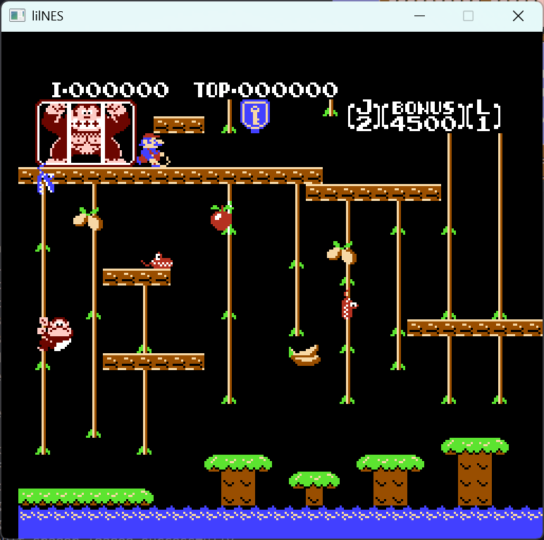
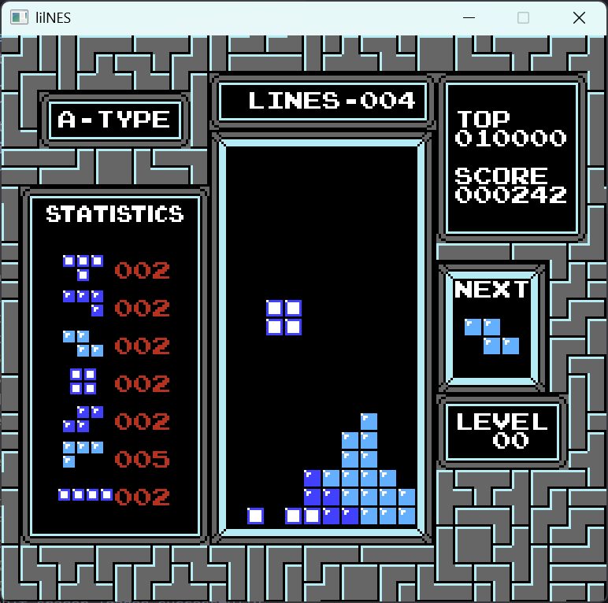
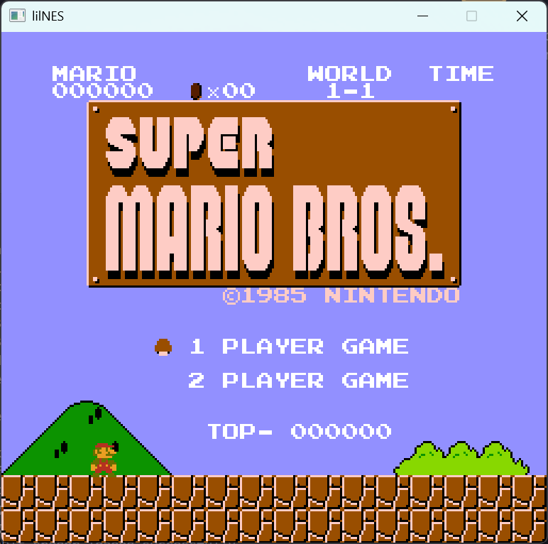

# lilNES

A little NES emulator with raylib.

## Current Features
- full emulation of 6502 CPU instructions
- working PPU with cycle stepped rendering, sprite 0 hit and dynamic mirroring
- parses iNES rom files, currently support for only mapper 0-3
- controls and color accurate rendering with raylib

## Future Features
- mapper 4 support
- interactive debugger with disassembler
- sprite and memory map viewer
- cycle accurate timing(works for the most part for now but fails some tests)
- APU implementation
- gui/cli emulator configuration

## Building
```
mkdir build
cd build
cmake ..
cmake --build . --config Release
```

## Usage
`lilNES.exe <rom path>`

### Controls
| NES Controller | Keyboard Input |
| :---           | :---           |
| **D-Pad Up**   | `Up Arrow`     |
| **D-Pad Down** | `Down Arrow`   |
| **D-Pad Left** | `Left Arrow`   |
| **D-Pad Right**| `Right Arrow`  |
| **A Button**   | `Z`            |
| **B Button**   | `X`            |
| **Start**      | `S`            |
| **Select**     | `A`            |

## Screenshots



